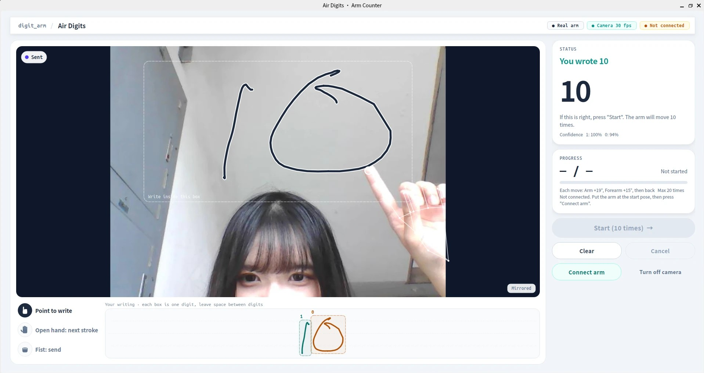
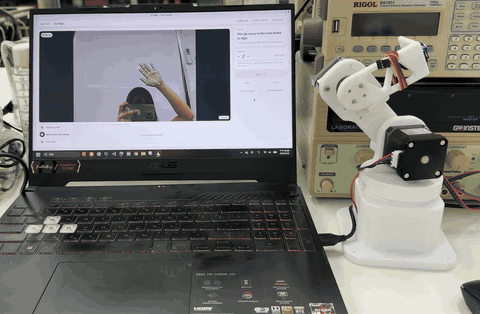
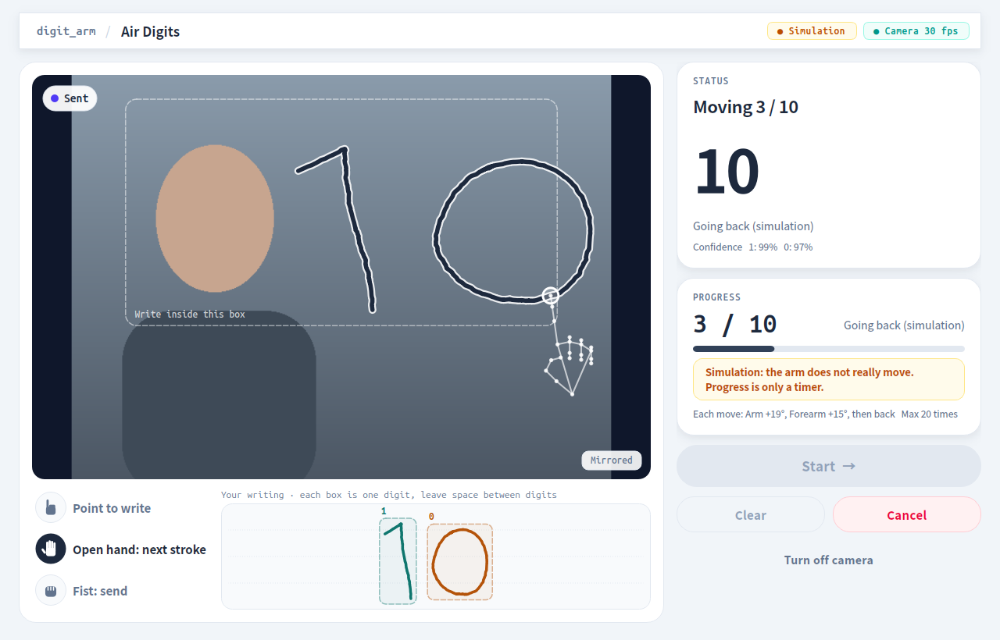

# Air Digits 空中寫數字 🤖✍️

**在筆電鏡頭前用食指寫一個數字，握拳送出，機器手臂就會動那麼多下。**
**Write a number in the air with your index finger, make a fist to send it, and the robot arm moves that many times.**

例如在空中寫「3」，畫面會顯示 **You wrote 3**，按下 **Start**，手臂就來回動 3 次。
For example, write "3" in the air. The screen shows **You wrote 3**. Press **Start** and the arm moves 3 times.



這個專案是用 **ROS 2（Jazzy 版）** 做的，適合拿來認識「ROS 怎麼把鏡頭、辨識、手臂串在一起」。
This project is built with **ROS 2 (Jazzy)**. It is a good way to learn how ROS connects a camera, a recognizer and a robot arm.

沒有接手臂也能玩：預設是 **模擬模式（Simulation）**，手臂不會真的動，但整個流程都看得到。
You can try it without an arm: the default is **Simulation mode**. The arm does not move, but you can see the whole flow.

### 示範影片 Demo



*在空中寫「2」→ 程式認出 2 → 按 Start → 手臂動 2 下（1.2 倍速）*
*Write "2" in the air → the app reads 2 → press Start → the arm moves 2 times (1.2× speed)*

---

## 目錄 Contents

1. [你需要準備什麼 What you need](#1-你需要準備什麼-what-you-need)
2. [第一次安裝 First-time setup](#2-第一次安裝-first-time-setup)
3. [開始玩（模擬模式）Try it (simulation)](#3-開始玩模擬模式-try-it-simulation)
4. [接上真的機器手臂 Use the real arm](#4-接上真的機器手臂-use-the-real-arm)
5. [常見問題 FAQ](#5-常見問題-faq)
6. [它是怎麼運作的？How it works (ROS)](#6-它是怎麼運作的-how-it-works-ros)
7. [給想改程式的同學 For developers](#7-給想改程式的同學-for-developers)

---

## 1. 你需要準備什麼 What you need

| 項目 Item | 說明 Details |
|---|---|
| 電腦 Computer | Windows 11 筆電，有內建鏡頭<br>Windows 11 laptop with a built-in camera |
| WSL | Windows 裡的 Linux 環境，要裝 **Ubuntu 24.04**<br>Linux inside Windows, with **Ubuntu 24.04** |
| ROS 2 | **Jazzy** 版，裝在 WSL 的 Ubuntu 裡<br>**Jazzy**, installed in Ubuntu (WSL) |
| Python | Windows 上的 **Python 3.12**（給鏡頭和 USB 用）<br>**Python 3.12** on Windows (for the camera and USB) |
| 機器手臂（可選）Robot arm (optional) | 社團的 3 軸步進馬達手臂：Arduino Uno + CNC Shield<br>The club's 3-axis stepper arm: Arduino Uno + CNC Shield |

> 💡 **為什麼要 WSL？** ROS 2 在 Linux 上最好用；但筆電鏡頭只有 Windows 讀得到。所以程式分兩邊：**ROS 在 WSL 裡跑，鏡頭和 USB 由 Windows 上的小程式負責**，兩邊會自動連起來，你不用管。
>
> 💡 **Why WSL?** ROS 2 works best on Linux, but only Windows can see the laptop camera. So the app has two parts: **ROS runs in WSL, and small Windows programs handle the camera and USB.** They connect automatically.

---

## 2. 第一次安裝 First-time setup

每一步都有指令，照順序複製貼上即可。**有 🪟 的在 Windows 的 PowerShell 執行，有 🐧 的在 WSL（Ubuntu）裡執行。**
Copy and paste each step in order. **🪟 = run in Windows PowerShell. 🐧 = run in WSL (Ubuntu).**

### 步驟 1：下載這個專案 Step 1: Download this project 🪟

按右上角綠色 **Code → Download ZIP** 解壓縮，或用 git：
Click the green **Code → Download ZIP** button and unzip it, or use git:

```bash
git clone https://github.com/clchrf/ntu-robotics-2026-robotarm-air-digits.git
```

### 步驟 2：安裝 Windows 端的 Python 套件 Step 2: Install Python packages on Windows 🪟

先到 [python.org](https://www.python.org/downloads/) 安裝 Python 3.12（安裝時勾選 **Add python.exe to PATH**），然後在專案資料夾裡執行：
Install Python 3.12 from [python.org](https://www.python.org/downloads/) (check **Add python.exe to PATH**), then run this in the project folder:

```bash
python -m pip install -r windows\requirements.txt
```

### 步驟 3：安裝 WSL 和 Ubuntu 24.04 Step 3: Install WSL and Ubuntu 24.04 🪟

```bash
wsl --install -d Ubuntu-24.04
```

裝好後重開機，第一次打開 Ubuntu 會要你設定帳號密碼。
Restart the computer. The first time you open Ubuntu, it asks you to make a user name and password.

### 步驟 4：在 Ubuntu 裡安裝 ROS 2 Jazzy Step 4: Install ROS 2 Jazzy in Ubuntu 🐧

照 ROS 官方教學安裝 **ros-jazzy-desktop**：
Follow the official ROS guide and install **ros-jazzy-desktop**:
👉 https://docs.ros.org/en/jazzy/Installation/Ubuntu-Install-Debs.html

### 步驟 5：安裝其他需要的套件 Step 5: Install other packages 🐧

```bash
sudo apt install -y python3-pyqt6 python3-opencv python3-serial python3-numpy python3-colcon-common-extensions fonts-noto-cjk
```

### 步驟 6：建置程式 Step 6: Build the app 🐧

先切到專案資料夾（把路徑換成你放專案的位置；Windows 的 `C:\` 在 WSL 裡是 `/mnt/c/`），例如：
Go to the project folder (change the path to where you put it; Windows `C:\` is `/mnt/c/` in WSL), for example:

```bash
cd /mnt/c/Users/你的名字/Desktop/ntu-robotics-2026-robotarm-air-digits
```

然後建置：
Then build:

```bash
bash scripts/setup_ws.sh
```

看到「建置完成」就好了 🎉
When you see "建置完成" (build done), you are ready 🎉

---

## 3. 開始玩（模擬模式） Try it (simulation)

在專案資料夾雙擊 **`Start-DigitArm.cmd`**。
Double-click **`Start-DigitArm.cmd`** in the project folder.

會先出現一個黑色視窗（那是 ROS 在背景工作，**不要關它**），幾秒後出現程式視窗，鏡頭自動打開。
A black window opens first (this is ROS working in the background, **do not close it**). After a few seconds the app window opens and the camera turns on.

### 手勢怎麼用 Hand gestures

| 手勢 Gesture | 意思 Meaning |
|---|---|
| ☝️ 只伸出食指 Point with index finger | **下筆**：開始寫<br>**Pen down**: start writing |
| ✋ 張開手掌 Open hand | **抬筆**：換下一筆，或移到下一個數字<br>**Pen up**: next stroke, or move to the next digit |
| ✊ 握拳約 1 秒 Fist for about 1 second | **送出**：指尖旁的橘色圈填滿就送出<br>**Send**: sent when the orange ring is full |

### 一次完整的流程 One full round

1. 在畫面上的**虛線框裡**用食指寫數字（字寫大一點、慢一點）。
   Write the number **inside the dashed box** with your index finger (big and slow).
2. 寫兩位數（例如 10）時，寫完「1」先張開手掌、往右移一點，再寫「0」。
   For two digits (like 10): after "1", open your hand, move a little to the right, then write "0".
3. 握拳送出，右邊會顯示 **You wrote 10**。
   Make a fist to send. The right side shows **You wrote 10**.
4. 對的話按 **Start** → 下面會顯示進度 **3 / 10**。
   If it is right, press **Start** → progress shows **3 / 10**.
5. 想停就按 **Cancel**（或鍵盤 Esc）。
   To stop, press **Cancel** (or Esc).
6. 做完按 **Clear**，再寫下一個。
   When done, press **Clear** and write the next one.

> 小提醒：畫面是**鏡像**的，像照鏡子一樣寫就對了。認不出來的時候程式會說「Could not read your number」，**不會亂動手臂**，按 Clear 重寫即可。最多一次動 20 下（可以在設定檔改）。
>
> Tip: the picture is **mirrored**, so write like you are looking in a mirror. If the app cannot read your number, it says "Could not read your number" and **the arm will not move**. Press Clear and try again. The limit is 20 times per round (you can change it in the config file).



---

## 4. 接上真的機器手臂 Use the real arm

> ⚠️ **安全第一**：第一次測試時，手放在馬達電源開關旁邊；手臂周圍不要有人或東西。按 Cancel 只會讓手臂停止並回到起點，**不是緊急停止**，真的有狀況請直接關馬達電源。
>
> ⚠️ **Safety first**: the first time, keep your hand near the motor power switch, and keep people and things away from the arm. **Cancel is not an emergency stop.** It only stops new moves and goes back to start. In an emergency, turn off the motor power.

### 步驟 1：把韌體燒進 Arduino（只要做一次） Step 1: Upload the firmware (only once)

1. 用 [Arduino IDE](https://www.arduino.cc/en/software) 打開 **`firmware/arm_controller/arm_controller.ino`**。
   Open **`firmware/arm_controller/arm_controller.ino`** in the [Arduino IDE](https://www.arduino.cc/en/software).
2. 開發板選 **Arduino Uno**，連接埠選手臂的 COM（例如 COM5）。
   Choose board **Arduino Uno** and the arm's COM port (for example COM5).
3. 按「上傳」。
   Click **Upload**.
4. 驗證：打開「序列埠監控視窗」，鮑率選 **115200**，按一下板子上的 reset，看到 `System Ready` 就成功了。**看完記得關掉監控視窗。**
   Check: open the **Serial Monitor** at **115200** baud and press reset on the board. You should see `System Ready`. **Close the Serial Monitor afterwards.**

這是 movearm 韌體的「加減速版」：通訊方式和原版一樣，但馬達會慢慢加速、慢慢停，比較不會卡住。
This is the movearm firmware with acceleration. It talks the same way as the original, but the motors speed up and slow down gently, so they get stuck less.

### 步驟 2：每次使用 Step 2: Every time you use it

1. 關掉會用到 USB 的程式（movearm.py、Arduino 序列埠監控視窗）。
   Close other programs that use the USB port (movearm.py, the Arduino Serial Monitor).
2. 插上 USB、打開馬達電源。
   Plug in the USB cable and turn on the motor power.
3. **用手把手臂擺到 HOME 姿勢**（movearm 程式裡的 Home，全部角度 0 的位置）。
   **Move the arm by hand to the HOME pose** (the movearm Home, where all angles are 0).
   👉 連線那一刻的姿勢就是「起點」，每一下都會回到這裡。
   👉 The pose at the moment you connect becomes the start pose. The arm comes back here after every move.
4. 雙擊 **`Start-DigitArm-RealArm.cmd`**。
   Double-click **`Start-DigitArm-RealArm.cmd`**.
5. 按 **Connect arm** → 確認手臂在 HOME → 按 Yes。右上角出現 **Connected** 就好了。
   Press **Connect arm** → check the arm is at HOME → press Yes. When you see **Connected** at the top right, you are ready.
6. 寫 **1** 試試看，按 Start，手臂應該動一下再回來。
   Write **1** and press Start. The arm should move once and come back.

### 每一下怎麼動？ What does one move look like?

預設是 **大臂 +19°、前臂 +15°，然後回到起點**。這個姿勢來自社團之前的繪圖校正資料，是手臂實際到過、不會撞到東西的位置。
By default: **Arm +19°, Forearm +15°, then back to start.** This pose comes from the club's old drawing calibration data. The arm has really been there without hitting anything.

想改的話，打開 `ros2_ws/src/digit_arm/config/digit_arm.yaml`，修改這三行（單位：度）：
To change it, open `ros2_ws/src/digit_arm/config/digit_arm.yaml` and edit these three lines (in degrees):

```yaml
motion_base_deg: 0.0
motion_arm_deg: 19.0
motion_forearm_deg: 15.0
```

改完存檔、重新開程式就好，不用重新建置。
Save the file and restart the app. No need to build again.

---

## 5. 常見問題 FAQ

| 問題 Problem | 怎麼辦 What to do |
|---|---|
| 鏡頭打不開 / 顯示 Camera not available<br>Camera does not open | 關掉 Teams、相機 App 等會用鏡頭的程式，再按 **Turn on camera**<br>Close Teams, the Camera app, etc., then press **Turn on camera** |
| 一直顯示 No hand / 看不到骨架線<br>Always "No hand", no hand lines | 開燈、不要背對窗戶；手離鏡頭大約 40–60 公分<br>Turn on the light, do not sit with a window behind you, keep your hand about 40–60 cm from the camera |
| 寫到一半顯示「Hand left the camera」<br>"Hand left the camera" while writing | 手掌出了畫面。請在**虛線框裡**寫，不要寫太下面<br>Your palm went out of view. Write **inside the dashed box**, not too low |
| 一直認錯或 Could not read<br>Wrong number or "Could not read" | 字寫大一點、慢一點；兩個數字中間**留空隙**<br>Write bigger and slower; **leave space** between digits |
| 握拳沒反應<br>Fist does nothing | 握緊、保持不動約 1 秒，看橘色圈有沒有填滿<br>Close your hand tightly and hold still for about 1 second until the orange ring is full |
| 看不到 Connect arm 按鈕<br>No "Connect arm" button | 你開的是模擬模式，請改用 `Start-DigitArm-RealArm.cmd`<br>You opened simulation mode. Use `Start-DigitArm-RealArm.cmd` |
| Connect arm 失敗<br>"Connect arm" fails | 確認 USB 有插、沒有其他程式占用 COM、韌體有燒好<br>Check the USB cable, close other programs using the COM port, and check the firmware is uploaded |
| 手臂只在原地抖、有馬達聲<br>Arm only shakes and hums | 可能卡住或力氣不夠：先關電源，檢查有沒有東西擋住；可在韌體把 `MAX_SPEED_DEG_S` 調小再燒一次<br>It may be blocked or too weak. Turn off the power and check for anything in the way. You can lower `MAX_SPEED_DEG_S` in the firmware and upload again |
| 做完後手臂沒回到原本位置<br>Arm does not come back to the same place | 可能「失步」了。關掉程式、用手擺回 HOME、重新 Connect arm<br>The motor may have skipped steps. Close the app, move the arm back to HOME by hand, and connect again |

---

## 6. 它是怎麼運作的？ How it works (ROS)

ROS（Robot Operating System）是一套讓「很多小程式互相傳訊息」的工具。這個專案把工作拆成 **4 個 ROS 節點（node）**，每個只做一件事：
ROS (Robot Operating System) is a tool that lets many small programs send messages to each other. This project splits the work into **4 ROS nodes**. Each node does one job:

```
 camera ─▶ ① hand node ──(topic: drawing)──▶ ② reader node ──(topic: result)──▶ ③ UI
                                                                                  │
                                              (action: move N times, progress, cancel)
                                                                                  ▼
                                       Arduino + arm ◀──(USB)── ④ motion node
```

| 節點 Node | 做什麼 What it does |
|---|---|
| ① `hand_gesture_node` | 從鏡頭找到手和食指，判斷下筆、抬筆、握拳，記錄筆跡<br>Finds your hand and index finger, knows pen down / pen up / fist, and records the drawing |
| ② `digit_recognizer_node` | 看筆跡，認出你寫的數字<br>Reads the number from the drawing |
| ③ `digit_arm_ui` | 你看到的視窗<br>The window you see |
| ④ `motion_executor_node` | 唯一會碰手臂的節點：透過 USB 送角度指令給 Arduino<br>The only node that talks to the arm: sends angle commands to the Arduino over USB |

節點之間的三種溝通方式 Three ways the nodes talk:

- **topic**：一直廣播的資料，像廣播電台（例如：手的位置、辨識結果）。
  **topic**: data that is sent again and again, like a radio station (for example: hand position, reading result).
- **service**：問一次、答一次（例如：按 Clear、按 Connect arm）。
  **service**: one question, one answer (for example: pressing Clear or Connect arm).
- **action**：要做很久的工作，會回報進度、可以中途取消（例如：按 Start 讓手臂動 N 下）。
  **action**: a long job that reports progress and can be canceled (for example: pressing Start to move the arm N times).

### 想親眼看到 ROS 在工作？ Want to see ROS working?

程式開著時，另外開一個 Ubuntu 視窗，先輸入：
While the app is open, open another Ubuntu window and first type:

```bash
source /opt/ros/jazzy/setup.bash && source ~/digit_arm_ws/install/setup.bash
```

然後試試這些指令 Then try these commands:

| 指令 Command | 會看到什麼 What you see |
|---|---|
| `ros2 node list` | 4 個正在跑的節點<br>The 4 running nodes |
| `ros2 topic echo /digit_arm/recognition` | 每次握拳送出，就印出辨識結果<br>The result, each time you make a fist |
| `ros2 action list` | 讓手臂動的 action：`/digit_arm/repeat_motion`<br>The action that moves the arm: `/digit_arm/repeat_motion` |
| `rqt_graph` | 把節點和它們的連線畫成一張圖<br>A picture of the nodes and their links |

### 安全設計 Safety

- 辨識不確定時，**不會**讓你按 Start。
  If the reading is unsure, you **cannot** press Start.
- 動作節點只接受「和目前辨識結果一樣」的次數。
  The motion node only accepts a count that matches the current result.
- 每動一步都要等 Arduino 回覆 `OK`；沒回覆、USB 斷線、Arduino 重開，都會馬上停止。
  Every move waits for the Arduino to reply `OK`. No reply, a lost USB link, or an Arduino restart stops everything at once.
- 按 Cancel 會立刻停止送出新動作，並回到起點。
  Cancel stops new moves right away and goes back to start.

---

## 7. 給想改程式的同學 For developers

```
Start-DigitArm.cmd              一鍵啟動（模擬模式）        One-click start (simulation)
Start-DigitArm-RealArm.cmd      一鍵啟動（真的手臂）        One-click start (real arm)
firmware/arm_controller/        Arduino 韌體（加減速版）    Arduino firmware (with acceleration)
windows/requirements.txt        Windows 端 Python 套件      Python packages for Windows
scripts/                        WSL 建置、啟動              Build and start scripts for WSL
tools/                          測試與檢查工具              Test and check tools
docs/PROTOCOL.md                手臂通訊方式（進階）        How the arm is controlled (advanced)
ros2_ws/src/digit_arm_interfaces/   ROS 訊息定義           ROS message and action types
ros2_ws/src/digit_arm/
  config/digit_arm.yaml         所有可調參數（最常改這個）  All settings (the file you change most)
  launch/digit_arm.launch.py    一次啟動 4 個節點           Starts the 4 nodes
  digit_arm/*_node.py           3 個 ROS 節點               The 3 ROS nodes
  digit_arm/ui/                 介面（PyQt6）               The window (PyQt6)
  digit_arm/core/               手勢、辨識、動作的核心程式  Core code: gestures, reading, motion
  digit_arm/workers/            Windows 端的鏡頭、USB 小程式 Camera and USB helpers for Windows
  test/                         單元測試                    Unit tests
```

跑測試（不需要鏡頭或手臂）🐧：
Run the tests (no camera or arm needed) 🐧:

```bash
cd ros2_ws/src/digit_arm && python3 -m pytest -q test
```

改了 `.msg` 或 `.action` 檔案才需要重新執行 `bash scripts/setup_ws.sh`；改 Python 或設定檔，重新開程式就好。
Only run `bash scripts/setup_ws.sh` again if you change a `.msg` or `.action` file. After changing Python code or the config file, just restart the app.

---

## 致謝 Credits

- 手部追蹤：Google [MediaPipe](https://developers.google.com/mediapipe) 的 Hand Landmarker 模型（`models/hand_landmarker.task`，Apache License 2.0）。
  Hand tracking: Google [MediaPipe](https://developers.google.com/mediapipe) Hand Landmarker model (`models/hand_landmarker.task`, Apache License 2.0).
- 手臂韌體與角度設定改自社團的 movearm 專案。
  The arm firmware and angle settings are based on the club's movearm project.
- 授權 License：[MIT](LICENSE)
