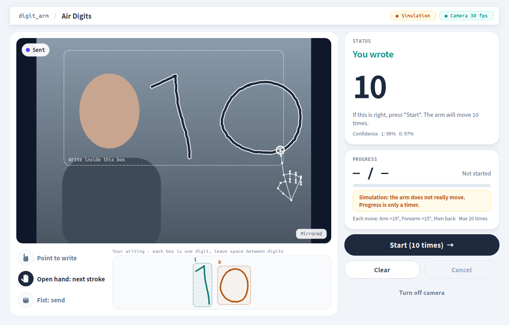

# Air Digits 空中寫數字 🤖✍️

**在筆電鏡頭前用食指寫一個數字，握拳送出，機器手臂就會動那麼多下。**

例如在空中寫「3」，畫面會顯示 **You wrote 3**，按下 **Start**，手臂就來回動 3 次。



這個專案是用 **ROS 2（Jazzy 版）** 做的，適合拿來認識「ROS 怎麼把鏡頭、辨識、手臂串在一起」。
沒有接手臂也能玩：預設是 **模擬模式（Simulation）**，手臂不會真的動，但整個流程都看得到。

---

## 目錄

1. [你需要準備什麼](#1-你需要準備什麼)
2. [第一次安裝（只要做一次）](#2-第一次安裝只要做一次)
3. [開始玩（模擬模式）](#3-開始玩模擬模式)
4. [接上真的機器手臂](#4-接上真的機器手臂)
5. [常見問題](#5-常見問題)
6. [它是怎麼運作的？（ROS 簡介）](#6-它是怎麼運作的ros-簡介)
7. [給想改程式的同學](#7-給想改程式的同學)

---

## 1. 你需要準備什麼

| 項目 | 說明 |
|---|---|
| 電腦 | Windows 11 筆電，有內建鏡頭 |
| WSL | Windows 裡的 Linux 環境，要裝 **Ubuntu 24.04** |
| ROS 2 | **Jazzy** 版，裝在 WSL 的 Ubuntu 裡 |
| Python | Windows 上的 **Python 3.12**（給鏡頭和 USB 用） |
| 機器手臂（可選） | 社團的 3 軸步進馬達手臂：Arduino Uno + CNC Shield |

> 💡 為什麼要 WSL？ROS 2 在 Linux 上最好用；但筆電鏡頭只有 Windows 讀得到。
> 所以程式分兩邊：**ROS 在 WSL 裡跑，鏡頭和 USB 由 Windows 上的小程式負責**，兩邊會自動連起來，你不用管。

---

## 2. 第一次安裝（只要做一次）

每一步都有指令，照順序複製貼上即可。**有 🪟 的在 Windows 的 PowerShell 執行，有 🐧 的在 WSL（Ubuntu）裡執行。**

### 步驟 1：下載這個專案 🪟

按右上角綠色 **Code → Download ZIP** 解壓縮，或用 git：

```bash
git clone https://github.com/clchrf/ntu-robotics-2026-robotarm-air-digits.git
```

### 步驟 2：安裝 Windows 端的 Python 套件 🪟

先到 [python.org](https://www.python.org/downloads/) 安裝 Python 3.12（安裝時勾選 **Add python.exe to PATH**），然後在專案資料夾裡執行：

```bash
python -m pip install -r windows\requirements.txt
```

### 步驟 3：安裝 WSL 和 Ubuntu 24.04 🪟

```bash
wsl --install -d Ubuntu-24.04
```

裝好後重開機，第一次打開 Ubuntu 會要你設定帳號密碼。

### 步驟 4：在 Ubuntu 裡安裝 ROS 2 Jazzy 🐧

照 ROS 官方教學安裝 **ros-jazzy-desktop**：
👉 https://docs.ros.org/en/jazzy/Installation/Ubuntu-Install-Debs.html

### 步驟 5：安裝其他需要的套件 🐧

```bash
sudo apt install -y python3-pyqt6 python3-opencv python3-serial python3-numpy python3-colcon-common-extensions fonts-noto-cjk
```

### 步驟 6：建置程式 🐧

先切到專案資料夾（把路徑換成你放專案的位置；Windows 的 `C:\` 在 WSL 裡是 `/mnt/c/`），例如：

```bash
cd /mnt/c/Users/你的名字/Desktop/air-digits-ros2-arm
```

然後建置：

```bash
bash scripts/setup_ws.sh
```

看到「建置完成」就好了 🎉

---

## 3. 開始玩（模擬模式）

在專案資料夾雙擊 **`Start-DigitArm.cmd`**。

會先出現一個黑色視窗（那是 ROS 在背景工作，**不要關它**），幾秒後出現程式視窗，鏡頭自動打開。

### 手勢怎麼用

| 手勢 | 意思 |
|---|---|
| ☝️ 只伸出食指 | **下筆**：開始寫 |
| ✋ 張開手掌 | **抬筆**：換下一筆，或移到下一個數字 |
| ✊ 握拳約 1 秒 | **送出**：指尖旁的橘色圈填滿就送出 |

### 一次完整的流程

1. 在畫面上的**虛線框裡**用食指寫數字（字寫大一點、慢一點）。
2. 寫兩位數（例如 10）時，寫完「1」先張開手掌、往右移一點，再寫「0」。
3. 握拳送出，右邊會顯示 **You wrote 10**。
4. 對的話按 **Start** → 下面會顯示進度 **3 / 10**。
5. 想停就按 **Cancel**（或鍵盤 Esc）。
6. 做完按 **Clear**，再寫下一個。

> 小提醒：畫面是**鏡像**的，像照鏡子一樣寫就對了。認不出來的時候程式會說「Could not read your number」，**不會亂動手臂**，按 Clear 重寫即可。
> 最多一次動 20 下（可以在設定檔改）。


---

## 4. 接上真的機器手臂

> ⚠️ **安全第一**：第一次測試時，手放在馬達電源開關旁邊；手臂周圍不要有人或東西。
> 按 Cancel 只會讓手臂停止並回到起點，**不是緊急停止**，真的有狀況請直接關馬達電源。

### 步驟 1：把韌體燒進 Arduino（只要做一次）

1. 用 [Arduino IDE](https://www.arduino.cc/en/software) 打開 **`firmware/arm_controller/arm_controller.ino`**。
2. 開發板選 **Arduino Uno**，連接埠選手臂的 COM（例如 COM5）。
3. 按「上傳」。
4. 驗證：打開「序列埠監控視窗」，鮑率選 **115200**，按一下板子上的 reset，看到 `System Ready` 就成功了。**看完記得關掉監控視窗。**

這是 movearm 韌體的「加減速版」：通訊方式和原版一樣，但馬達會慢慢加速、慢慢停，比較不會卡住。

### 步驟 2：每次使用

1. 關掉會用到 USB 的程式（movearm.py、Arduino 序列埠監控視窗）。
2. 插上 USB、打開馬達電源。
3. **用手把手臂擺到 HOME 姿勢**（movearm 程式裡的 Home，全部角度 0 的位置）。
   👉 連線那一刻的姿勢就是「起點」，每一下都會回到這裡。
4. 雙擊 **`Start-DigitArm-RealArm.cmd`**。
5. 按 **Connect arm** → 確認手臂在 HOME → 按 Yes。右上角出現 **Connected** 就好了。
6. 寫 **1** 試試看，按 Start，手臂應該動一下再回來。

### 每一下怎麼動？

預設是 **大臂 +19°、前臂 +15°，然後回到起點**。這個姿勢來自社團之前的繪圖校正資料，是手臂實際到過、不會撞到東西的位置。
想改的話，打開 `ros2_ws/src/digit_arm/config/digit_arm.yaml`，修改這三行（單位：度）：

```yaml
motion_base_deg: 0.0
motion_arm_deg: 19.0
motion_forearm_deg: 15.0
```

改完存檔、重新開程式就好，不用重新建置。

---

## 5. 常見問題

| 問題 | 怎麼辦 |
|---|---|
| 鏡頭打不開 / 顯示 Camera not available | 關掉 Teams、相機 App 等會用鏡頭的程式，再按 **Turn on camera** |
| 一直顯示 No hand / 看不到骨架線 | 開燈、不要背對窗戶；手離鏡頭大約 40–60 公分 |
| 寫到一半顯示「Hand left the camera」 | 手掌出了畫面。請在**虛線框裡**寫，不要寫太下面 |
| 一直認錯或 Could not read | 字寫大一點、慢一點；兩個數字中間**留空隙** |
| 握拳沒反應 | 握緊、保持不動約 1 秒，看橘色圈有沒有填滿 |
| 看不到 Connect arm 按鈕 | 你開的是模擬模式，請改用 `Start-DigitArm-RealArm.cmd` |
| Connect arm 失敗 | 確認 USB 有插、沒有其他程式占用 COM、韌體有燒好 |
| 手臂只在原地抖、有馬達聲 | 可能卡住或力氣不夠：先關電源，檢查有沒有東西擋住；可在韌體把 `MAX_SPEED_DEG_S` 調小再燒一次 |
| 做完後手臂沒回到原本位置 | 可能「失步」了。關掉程式、用手擺回 HOME、重新 Connect arm |

---

## 6. 它是怎麼運作的？（ROS 簡介）

ROS（Robot Operating System）是一套讓「很多小程式互相傳訊息」的工具。
這個專案把工作拆成 **4 個 ROS 節點（node）**，每個只做一件事：

```
 鏡頭 ─▶ ① 手勢節點 ──(topic: 筆跡)──▶ ② 辨識節點 ──(topic: 結果)──▶ ③ 介面
                                                                     │
                                            (action: 動 N 下，可看進度、可取消)
                                                                     ▼
                                    Arduino + 手臂 ◀──(USB)── ④ 動作節點
```

| 節點 | 做什麼 |
|---|---|
| ① `hand_gesture_node` | 從鏡頭找到手和食指，判斷下筆、抬筆、握拳，記錄筆跡 |
| ② `digit_recognizer_node` | 看筆跡，認出你寫的數字 |
| ③ `digit_arm_ui` | 你看到的視窗 |
| ④ `motion_executor_node` | 唯一會碰手臂的節點：透過 USB 送角度指令給 Arduino |

節點之間的三種溝通方式：

- **topic**：一直廣播的資料，像廣播電台（例如：手的位置、辨識結果）。
- **service**：問一次、答一次（例如：按 Clear、按 Connect arm）。
- **action**：要做很久的工作，會回報進度、可以中途取消（例如：按 Start 讓手臂動 N 下）。

### 想親眼看到 ROS 在工作？

程式開著時，另外開一個 Ubuntu 視窗，先輸入：

```bash
source /opt/ros/jazzy/setup.bash && source ~/digit_arm_ws/install/setup.bash
```

然後試試這些指令：

| 指令 | 會看到什麼 |
|---|---|
| `ros2 node list` | 4 個正在跑的節點 |
| `ros2 topic echo /digit_arm/recognition` | 每次握拳送出，就印出辨識結果 |
| `ros2 action list` | 讓手臂動的 action：`/digit_arm/repeat_motion` |
| `rqt_graph` | 把節點和它們的連線畫成一張圖 |

### 安全設計

- 辨識不確定時，**不會**讓你按 Start。
- 動作節點只接受「和目前辨識結果一樣」的次數。
- 每動一步都要等 Arduino 回覆 `OK`；沒回覆、USB 斷線、Arduino 重開，都會馬上停止。
- 按 Cancel 會立刻停止送出新動作，並回到起點。

---

## 7. 給想改程式的同學

```
Start-DigitArm.cmd              一鍵啟動（模擬模式）
Start-DigitArm-RealArm.cmd      一鍵啟動（真的手臂）
firmware/arm_controller/        Arduino 韌體（加減速版 movearm）
windows/requirements.txt        Windows 端 Python 套件
scripts/                        WSL 建置、啟動
tools/                          測試與檢查工具
docs/PROTOCOL.md                手臂通訊方式（進階）
ros2_ws/src/digit_arm_interfaces/   ROS 訊息定義（msg、action）
ros2_ws/src/digit_arm/
  config/digit_arm.yaml         所有可調參數（最常改這個）
  launch/digit_arm.launch.py    一次啟動 4 個節點
  digit_arm/*_node.py           3 個 ROS 節點
  digit_arm/ui/                 介面（PyQt6）
  digit_arm/core/               手勢、辨識、動作的核心程式（不需要 ROS 也能測試）
  digit_arm/workers/            Windows 端的鏡頭、USB 小程式
  test/                         單元測試
```

跑測試（不需要鏡頭或手臂）🐧：

```bash
cd ros2_ws/src/digit_arm && python3 -m pytest -q test
```

改了 `.msg` 或 `.action` 檔案才需要重新執行 `bash scripts/setup_ws.sh`；改 Python 或設定檔，重新開程式就好。

---

## 致謝

- 手部追蹤：Google [MediaPipe](https://developers.google.com/mediapipe) 的 Hand Landmarker 模型（`models/hand_landmarker.task`，Apache License 2.0）。
- 手臂韌體與角度設定改自社團的 movearm 專案。
